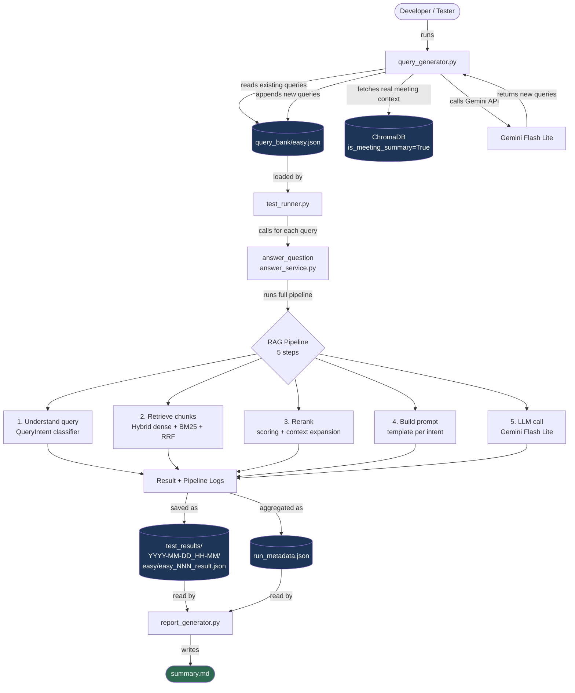

# Testing Guide — AI Meeting Intelligence Chatbot

This guide explains how the automated test suite works, what each script does,
and the exact commands to run. Read this before touching any test file.

---

## Quick Start — 1 Command

Run the full test cycle with a single command:

```powershell
# Run easy level: test_runner → report_generator → open report
python -m app.tests.run_tests --project-id proj_nolocode_001

# Run medium level
python -m app.tests.run_tests --project-id proj_nolocode_001 --difficulty medium

# Run all levels (easy → medium → hard) in sequence
python -m app.tests.run_tests --project-id proj_nolocode_001 --difficulty all

# Run without auto-opening the report
python -m app.tests.run_tests --project-id proj_nolocode_001 --no-open
```

`run_tests.py` chains `test_runner` → `report_generator` automatically,
creates a timestamped folder, and opens the report when done.
The report is written to `test_results/<run_id>/<difficulty>_summary.md`.

**Or manually (3 steps):**

```powershell
# Step 1 — Run queries
python -m app.tests.test_runner --project-id proj_nolocode_001

# Step 2 — Generate report
python -m app.tests.report_generator

# Step 3 — Open report
code app/tests/test_results/<latest-run-folder>/summary.md
```

The rest of this guide explains what's happening under the hood.

---

## What This Test Suite Checks

Every time you change the pipeline (retrieval logic, chunking, prompts, reranker),
you run this suite to verify:

| Check | What it means |
|---|---|
| Intent match | Did the classifier route the query to the correct retrieval path? |
| Has answer | Did the pipeline return real content instead of "not found"? |
| Pipeline logs | If something failed, which step broke and why? |

It does NOT check factual correctness of answers (that is planned for the LLM evaluator).

---

## System Flow



---

## Folder Structure

```
app/tests/
├── TESTING_GUIDE.md          ← you are here
│
├── query_bank/               ← test query definitions
│   ├── easy.json             ← simple queries (regex-catchable intent)
│   ├── medium.json           ← paraphrased queries (LLM classifier needed)
│   └── hard.json             ← edge cases, ambiguous intent, missing data
│
├── test_results/             ← one folder per test run (auto-created)
│   └── 2026-05-25_14-30/
│       ├── run_metadata.json        ← aggregate stats for the last completed level
│       ├── easy_summary.md          ← easy level report  (open this)
│       ├── medium_summary.md        ← medium level report (if --difficulty all)
│       ├── hard_summary.md          ← hard level report   (if --difficulty all)
│       ├── easy/
│       │   ├── ml_001_result.json
│       │   ├── ml_002_result.json
│       │   └── ...
│       └── medium/
│           ├── mm_001_result.json
│           └── ...
│
├── query_generator.py        ← generates new queries using Gemini API
├── test_runner.py            ← runs queries against the real pipeline
├── report_generator.py       ← reads results and writes summary.md
└── run_tests.py              ← master runner: chains all three + opens report
```

---

## Script Reference

### `run_tests.py` — Master runner (start here)

Chains `test_runner` → `report_generator` automatically.
All runs for a single invocation share one timestamped folder.

```powershell
# Run easy suite (default) — auto-opens report when done
python -m app.tests.run_tests --project-id proj_nolocode_001

# Run medium suite
python -m app.tests.run_tests --project-id proj_nolocode_001 --difficulty medium

# Run all levels in sequence (easy → medium → hard)
python -m app.tests.run_tests --project-id proj_nolocode_001 --difficulty all

# Run a subset by query ID (useful for debugging specific failures)
python -m app.tests.run_tests --project-id proj_nolocode_001 --ids ml_001,ml_005

# Run a subset by tag
python -m app.tests.run_tests --project-id proj_nolocode_001 --tags decision,commitment

# Suppress auto-open (e.g. in CI)
python -m app.tests.run_tests --project-id proj_nolocode_001 --no-open
```

**Outputs per run:**

| File | Description |
|---|---|
| `test_results/<run_id>/easy_summary.md` | Easy level report |
| `test_results/<run_id>/medium_summary.md` | Medium level report (if run) |
| `test_results/<run_id>/run_metadata.json` | JSON stats for the last completed level |
| `test_results/<run_id>/easy/*.json` | Per-query result files (easy) |

**When to run:** After any change to the pipeline. The default (easy only) takes ~3 minutes.

---

### `query_generator.py` — Add more queries

Reads `easy.json` as examples, fetches real meeting summaries from ChromaDB,
then asks Gemini to generate more queries that match the same difficulty and schema.
New queries are appended to `easy.json` with auto-incremented IDs.

```powershell
# Generate 5 new queries grounded in your real meeting data (recommended)
python -m app.tests.query_generator --project-id proj_nolocode_001 --count 5

# Preview without saving
python -m app.tests.query_generator --project-id proj_nolocode_001 --count 5 --dry-run

# Generate without DB context (generic tech topics — not recommended)
python -m app.tests.query_generator --count 5
```

**When to run:** When you want more test coverage. Not needed every session.

---

### `test_runner.py` — Execute the test suite

Reads every query in `easy.json`, calls `answer_question()` directly (no HTTP,
no mocking), captures the full pipeline log for each query, and saves individual
result JSON files plus a `run_metadata.json` summary.

```powershell
# See which queries would run — no pipeline calls
python -m app.tests.test_runner --project-id proj_nolocode_001 --dry-run

# Run the full suite
python -m app.tests.test_runner --project-id proj_nolocode_001
```

**When to run:** After any change to the pipeline. Takes ~2 minutes for 12 queries.

**What you see live:**
```
  [01/12] PASS   5359ms  Give me a summary of the last meeting...    intent=summary_query
  [02/12] PASS   4102ms  What decisions were made in the meetings?   intent=decision_query
  [03/12] FAIL   3841ms  What was discussed in the project meetings  intent=summary_query  [expected=general_query]
```

**Pass/Fail rules:**

| Status | Meaning |
|---|---|
| `PASS` | Correct intent classification AND real answer returned |
| `FAIL` | Wrong intent classification OR pipeline returned "not found" |
| `ERR` | Pipeline threw an exception |

---

### `report_generator.py` — Build the human-readable report

Reads all `easy/*_result.json` files and `run_metadata.json` from the latest
(or specified) run folder, then writes `summary.md` with:
- Pass rate summary with progress bar
- Full results table (every query, status, intent, response time)
- Intent breakdown by type (which classifier path has the most failures)
- Failed query details with full pipeline trace
- Sources coverage (which meetings were referenced)

```powershell
# Generate report for the latest run (most common)
python -m app.tests.report_generator

# Generate report for a specific run
python -m app.tests.report_generator --run 2026-05-20_11-06
```

**When to run:** Right after `test_runner.py` finishes.

---

## How to Read a Result File

Each `easy_NNN_result.json` contains:

```
query_id         → which query this is (easy_001, easy_002, ...)
query            → the question text that was sent to the pipeline
expected_intent  → what the query bank says the classifier SHOULD choose
actual_intent    → what the classifier actually chose
intent_match     → true/false — the most important check
has_answer       → true if a real answer was returned (not "not found")
status           → "passed" | "failed" | "error"
response_time_ms → how long the full pipeline took in milliseconds
answer           → the LLM-generated answer text
sources          → which meeting chunks were used to build the answer
pipeline_logs    → full trace of all 5 pipeline steps (use this to debug failures)
```

**To debug a failure:** open `pipeline_logs` and look for the `[1/5] UNDERSTAND QUERY` line.
The intent the classifier chose is logged there. That tells you exactly where the routing went wrong.

---

## How to Read `summary.md`

Open `test_results/<run-folder>/summary.md` in your IDE.

1. **Summary section** — Check the pass rate bar. Below 80% means something is broken.
2. **Intent breakdown** — Find which intent type has the most failures. That tells you which retrieval path has the bug.
3. **Failed queries section** — Each failure shows the pipeline trace in a code block. No need to re-run or open JSON files.
4. **Sources referenced** — If only 1 meeting is referenced across all queries, retrieval may be broken for older meetings.

---

## Query Difficulty Levels

| Level | File | What it tests | Classifier needed |
|---|---|---|---|
| Easy | `easy.json` | Queries with direct regex-trigger keywords | Regex only |
| Medium | `medium.json` | Paraphrased queries, speaker names, date filters | LLM classifier |
| Hard | `hard.json` | Edge cases, missing data, cross-meeting reasoning | LLM + inference |

**Current status:** Easy (21 queries) and medium (20 queries) are fully active.
Hard has 7 queries — expand to 10–15 with cross-meeting and contradiction scenarios.

---

## Adding New Queries Manually

If you want to add a query directly to `easy.json` without using `query_generator.py`,
follow this schema exactly:

```json
{
  "id": "easy_NNN",
  "query": "Your question text here",
  "expected_intent": "summary_query",
  "expected_strategy": "summary_chunks_raw_collection",
  "tags": ["summary", "regex-catchable"],
  "notes": "One sentence: what this query tests and why it is easy",
  "evaluation_hints": {
    "must_contain": ["what a good answer must include"],
    "must_not_contain": ["what a good answer must NOT say"],
    "should_cite_sources": true,
    "expected_source_type": "is_meeting_summary=True chunk"
  }
}
```

**Valid values for `expected_intent`:**
`summary_query` | `decision_query` | `commitment_query` | `question_query` | `general_query`

**Valid values for `expected_strategy`:**
`summary_chunks_raw_collection` | `hybrid_retrieve_no_filter` |
`hybrid_retrieve_contains_commitment_filter` | `hybrid_retrieve_contains_question_filter`

---

## Project ID Reference

| Project | ID |
|---|---|
| Nolocode | `proj_nolocode_001` |

Add new projects here when they are ingested.
